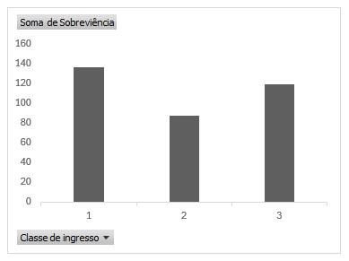

# Análise do Dataset Titanic  

Projeto simples para praticar análise de dados.  

## Ferramentas Usadas  
Excel

## Resultados  
1. Média de idade dos passageiros: ~29.8 anos  
2. 1ª classe teve mais sobreviventes que a 3ª

## Gráfico de Sobreviventes por Classe  
  

